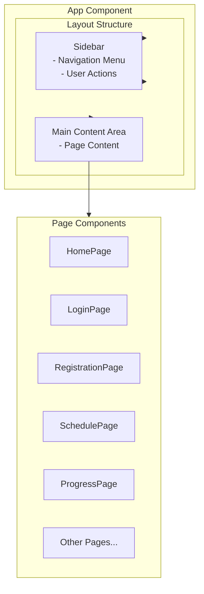
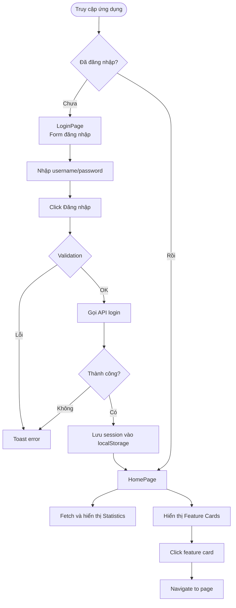
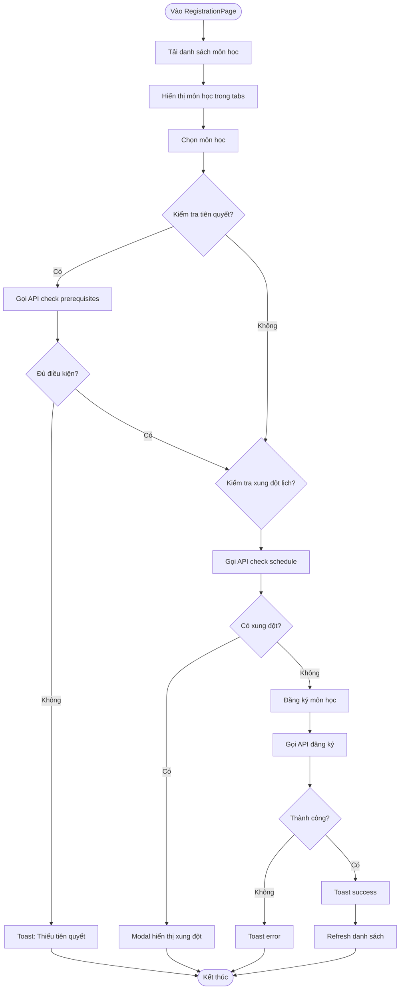

# CHƯƠNG V. GIAO DIỆN NGƯỜI DÙNG - HỆ THỐNG SINH VIÊN (SGU)


## 1. Giới thiệu


### 1.1. Mô tả tổng quan


Hệ thống quản lý sinh viên (SGU) là ứng dụng frontend được xây dựng bằng **React 19.1.1** và **Vite 7.1.7**, cung cấp giao diện cho sinh viên để quản lý học tập, đăng ký môn học, xem điểm số, lịch học và các dịch vụ liên quan. Hệ thống tích hợp với backend Django thông qua REST API.


### 1.2. Các thành phần chính


Hệ thống được tổ chức theo kiến trúc component-based:


- **Layout Components**: Layout.jsx, Sidebar.jsx - Cấu trúc tổng thể và điều hướng

- **Pages**: 11 trang chức năng chính

- **Services**: Lớp xử lý API và business logic

- **Components**: Các component UI tái sử dụng


### 1.3. Công nghệ sử dụng


**Core Framework:**

- React 19.1.1 - UI framework

- Vite 7.1.7 - Build tool và dev server


**UI Libraries:**

- Tailwind CSS - Styling framework

- Radix UI - Accessible component primitives

- Lucide React - Icon library

- react-hot-toast - Toast notifications


**Utilities:**

- date-fns - Date utility library

- clsx, tailwind-merge - CSS utility helpers


## 2. Kiến trúc hệ thống


### 2.1. Cấu trúc Layout


Hệ thống sử dụng layout pattern với Sidebar và Main Content:





**Layout Component (`Layout.jsx`):**

- Quản lý Sidebar state (mở/đóng trên mobile)

- Tích hợp logout functionality

- Xử lý authentication state

- Responsive design cho mobile và desktop


**Sidebar Component (`Sidebar.jsx`):**

- Navigation menu với 10 mục chính

- Expandable sections cho navigation và actions

- Active state highlighting

- Mobile overlay với backdrop


### 2.2. Service Layer Architecture


Hệ thống sử dụng service layer để tách biệt business logic:


**Core Services:**

- `apiService.js`: Core API service với authentication headers

- `authService.js`: Xử lý đăng nhập, đăng xuất, session management


**Domain Services:**

- `registrationService.js`: Đăng ký môn học

- `scheduleService.js`: Lịch học

- `gradesService.js`: Điểm số

- `progressService.js`: Tiến độ học tập

- `documentsService.js`: Quản lý giấy tờ

- `notificationsService.js`: Thông báo

- `tuitionService.js`: Học phí

- `userService.js`: Thông tin người dùng

- `readOnlyService.js`: Dữ liệu tra cứu (khoa, ngành, môn học)


## 3. Các chức năng chính


### 3.1. Navigation Items


Sidebar cung cấp 10 mục điều hướng chính:


1. **Trang chủ** - Dashboard tổng quan

2. **Đăng ký môn học** - Đăng ký và quản lý môn học

3. **Lịch học** - Xem lịch học theo tuần

4. **Xem lớp học** - Danh sách lớp đã đăng ký

5. **Tiến độ học** - Điểm số và tiến độ học tập

6. **Đăng ký giấy** - Yêu cầu các loại giấy tờ

7. **Nhận thông báo** - Xem và quản lý thông báo

8. **Cập nhật thông tin cá nhân** - Profile và đổi mật khẩu

9. **Tra cứu** - Tra cứu khoa, ngành, môn học

10. **Học phí** - Xem và quản lý học phí


## 4. Chi tiết các trang chức năng


### 4.1. LoginPage


**Chức năng:**

- Form đăng nhập với username và password

- Password visibility toggle

- Validation: Kiểm tra username và password không rỗng

- Gọi API: `POST /api/auth/student/login/`

- Xử lý kết quả:

  - Thành công: Lưu session, chuyển đến HomePage

  - Thất bại: Hiển thị toast error với message từ API

- Loading state: Disable form và hiển thị spinner khi đang xử lý


**API Integration:**

```javascript

authService.login(username, password)

  → POST /api/auth/student/login/

  → Lưu session_key vào localStorage

  → Trả về user info

```


### 4.2. HomePage


**Chức năng:**

- Hiển thị thông tin tổng quan sinh viên

- Fetch data từ 2 API:

  - `GET /api/student/profile/` - Thông tin sinh viên

  - `GET /api/services/notifications/unread/` - Số thông báo chưa đọc


**Statistics hiển thị:**

- Mã sinh viên (studentCode)

- GPA (từ profile)

- Số thông báo chưa đọc

- Tổng tín chỉ (totalCredits)

- Lớp học (className)


**Feature Cards:**

- 9 feature cards để navigate đến các trang:

  1. Xem lớp học

  2. Đăng ký môn học

  3. Lịch học

  4. Đăng ký giấy tờ

  5. Học phí

  6. Thông báo

  7. Hồ sơ cá nhân

  8. Tra cứu thông tin

  9. Tiến độ học


**Luồng xử lý:**

1. Component mount → Fetch user data và notifications

2. Hiển thị loading spinner

3. Render statistics và feature cards

4. Click feature card → Navigate đến trang tương ứng


### 4.3. RegistrationPage


**Chức năng chính:**

- Xem danh sách môn học có sẵn để đăng ký

- Xem danh sách môn học đã đăng ký

- Đăng ký môn học mới

- Kiểm tra tiên quyết (prerequisites)

- Kiểm tra xung đột lịch học


**Tabs:**

1. **Available Courses**: Môn học có sẵn

2. **My Registrations**: Môn học đã đăng ký


**Available Courses Tab:**


**Data Fetching:**

- `GET /api/services/registration/available-courses/{username}/`

- Trả về danh sách courses với thông tin:

  - courseClassId, courseCode, courseName

  - credits, availableSlots, maxSlots

  - schedule (dayOfWeek, startTime, endTime, room)

  - prerequisites


**Actions:**

1. **Check Prerequisites**: 

   - API: `POST /api/services/registration/check-prerequisites/`

   - Payload: `{ courseClassId, studentId }`

   - Hiển thị modal với danh sách prerequisites và trạng thái đã hoàn thành


2. **Check Schedule Conflict**:

   - API: `POST /api/services/registration/check-schedule-conflict/`

   - Payload: `{ courseClassId, studentId }`

   - Trả về: `{ hasConflict, conflicts: [] }`

   - Hiển thị modal với danh sách môn học xung đột


3. **Register Course**:

   - Kiểm tra availableSlots > 0

   - Tự động check schedule conflict trước

   - Nếu có conflict → Hiển thị error và modal

   - Nếu không conflict → Gọi API đăng ký

   - API: `POST /api/crud/registrations/create/`

   - Payload: `{ courseClass, student }`

   - Refresh danh sách sau khi thành công


**My Registrations Tab:**

- Hiển thị danh sách môn học đã đăng ký

- Data từ: `GET /api/student/my-registrations/`

- Hiển thị thông tin: course code, name, credits, schedule, status


**Status Badges:**

- Available (green) - Còn chỗ

- Full (red) - Đã hết chỗ

- Registered (blue) - Đã đăng ký


### 4.4. SchedulePage


**Chức năng:**

- Hiển thị lịch học theo tuần

- Filter theo ngày trong tuần

- Hiển thị thông tin chi tiết từng buổi học


**Data Fetching:**

- `GET /api/student/my-schedule/`

- Trả về danh sách schedule items với:

  - courseCode, courseName

  - dayOfWeek, startTime, endTime

  - room, building

  - status (registered, pending, cancelled)


**Filter:**

- Dropdown để chọn ngày: Tất cả, Thứ 2-7, Chủ nhật

- Filter client-side dựa trên dayOfWeek


**Hiển thị:**

- Card cho mỗi buổi học

- Thông tin: Thời gian, phòng học, tên môn học

- Status badge với màu sắc tương ứng

- Group theo ngày trong tuần


### 4.5. ProgressPage


**Chức năng:**

- Xem điểm số và kết quả học tập

- Xem lớp học đã hoàn thành

- Xem tiến độ theo học kỳ

- Xem thành tích và mục tiêu


**Tabs:**

1. **Điểm số và kết quả học tập**

2. **Lớp học đã hoàn thành**

3. **Theo học kỳ**

4. **Thành tích**

5. **Mục tiêu**


**Tab 1: Điểm số và kết quả học tập**


**Data Fetching:**

- `GET /api/student/my-grades/`

- Trả về: `{ grades: [], gpa, totalCredits }`


**Hiển thị:**

- Horizontal scroll layout với cards

- Mỗi card hiển thị:

  - Course code và name

  - Credits

  - Average score (điểm trung bình)

  - Grade (A, B, C, D, F)

  - Status (Passed/Failed)

- Click card → Modal hiển thị chi tiết:

  - Assignment score

  - Midterm score

  - Final score

  - Average score

  - Grade (hệ 4)

  - Classification


**Tab 2: Lớp học đã hoàn thành**

- Data từ: `GET /api/student/my-completed-courses/`

- Hiển thị danh sách môn học đã pass

- Thông tin: course code, name, credits, semester, final grade


**Tab 3: Theo học kỳ**

- Group grades theo semester

- Hiển thị GPA từng học kỳ

- Tổng hợp credits và số môn học


**Tab 4: Thành tích**

- Hiển thị các achievements (mock data)

- Progress bars cho các mục tiêu


**Tab 5: Mục tiêu**

- Hiển thị learning goals (mock data)

- Progress tracking với deadlines


### 4.6. DocumentsPage


**Chức năng:**

- Xem danh sách loại giấy tờ có sẵn

- Tạo yêu cầu giấy tờ

- Xem và quản lý yêu cầu đã tạo


**Tabs:**

1. **Loại giấy tờ**

2. **Yêu cầu của tôi**


**Tab 1: Loại giấy tờ**


**Data Fetching:**

- `GET /api/crud/document-types/`

- Trả về danh sách document types với: id, name, description, fee


**Actions:**

- Quick create: Click button "Đăng ký" trên card

- Form create: Mở form với documentTypeId và purpose


**Tab 2: Yêu cầu của tôi**


**Data Fetching:**

- `GET /api/student/my-document-requests/`

- Trả về danh sách requests với:

  - documentType name

  - purpose

  - status (pending, approved, rejected, completed)

  - createdAt, updatedAt


**Create Request:**

- API: `POST /api/crud/document-requests/create/`

- Payload: `{ documentType, student, purpose }`

- Validation: Kiểm tra đã tạo request cho loại này chưa

- Error handling: Hiển thị error nếu đã đăng ký rồi


**Status:**

- Pending (yellow) - Chờ xử lý

- Approved (green) - Đã duyệt

- Rejected (red) - Từ chối

- Completed (blue) - Hoàn thành


### 4.7. NotificationsPage


**Chức năng:**

- Xem danh sách thông báo

- Đánh dấu đã đọc

- Filter theo trạng thái đọc/chưa đọc


**Data Fetching:**

- `GET /api/student/my-notifications/`

- Trả về danh sách notifications với:

  - title, content

  - isRead

  - createdAt

  - notification type


**Actions:**

- Mark as read: 

  - API: `POST /api/services/notifications/{id}/mark-read/`

  - Update local state sau khi thành công


**Hiển thị:**

- List với unread/read indicators

- Timestamp

- Click để xem chi tiết


### 4.8. ProfilePage


**Chức năng:**

- Xem thông tin cá nhân

- Cập nhật thông tin

- Đổi mật khẩu


**Data Fetching:**

- `GET /api/student/profile/`

- Hiển thị: studentCode, fullName, email, phone, dateOfBirth, address, gender, major, class


**Update Profile:**

- API: `PUT /api/student/profile/update/`

- Payload: Các trường có thể cập nhật

- Validation: Kiểm tra format email, phone


**Change Password:**

- API: `POST /api/auth/change-password/`

- Payload: `{ oldPassword, newPassword, confirmPassword }`

- Validation: 

  - newPassword === confirmPassword

  - newPassword length >= 8

- Success: Toast notification và clear form


### 4.9. TuitionPage


**Chức năng:**

- Xem danh sách học phí theo học kỳ

- Xem trạng thái thanh toán


**Data Fetching:**

- `GET /api/student/my-tuition-fees/`

- Trả về danh sách tuition fees với:

  - semester

  - amount

  - status (unpaid, paid, partial)

  - dueDate

  - paymentDate


**Hiển thị:**

- List hoặc cards theo semester

- Status badges

- Payment information (đóng trực tiếp tại phòng tài chính)


### 4.10. ClassesPage


**Chức năng:**

- Xem danh sách lớp học đã đăng ký

- Xem thông tin chi tiết lớp học


**Data Fetching:**

- `GET /api/student/my-registrations/`

- Hoặc từ scheduleService


**Hiển thị:**

- Danh sách classes với:

  - Course code và name

  - Schedule (ngày, giờ, phòng)

  - Teacher name

  - Status


### 4.11. LookupPage


**Chức năng:**

- Tra cứu khoa (Departments)

- Tra cứu ngành (Majors)

- Tra cứu môn học (Subjects)

- Tra cứu lớp học (Course Classes)


**Tabs:**

1. **Khoa** - `GET /api/crud/departments/`

2. **Ngành** - `GET /api/crud/majors/`

3. **Môn học** - `GET /api/crud/subjects/`

4. **Lớp học** - `GET /api/crud/course-classes/`


**Features:**

- Search functionality (client-side hoặc server-side)

- Filter options

- Pagination (nếu có)

- Display results trong cards hoặc table


## 5. Xử lý dữ liệu và State Management


### 5.1. Data Fetching Pattern


Tất cả các trang sử dụng pattern tương tự:


```javascript

const [data, setData] = useState([]);

const [loading, setLoading] = useState(true);


useEffect(() => {

  fetchData();

}, []);


const fetchData = async () => {

  try {

    setLoading(true);

    const result = await service.getData();

    if (result.success) {

      setData(result.data);

    } else {

      toast.error(result.message);

    }

  } catch (error) {

    toast.error('Có lỗi xảy ra');

  } finally {

    setLoading(false);

  }

};

```


### 5.2. Error Handling


**API Errors:**

- 401 Unauthorized: Auto logout và redirect đến login

- 403 Forbidden: Toast error

- 400 Bad Request: Toast error với message từ API

- 500 Server Error: Toast error generic

- Network errors: Toast error "Không thể kết nối đến server"


**Validation Errors:**

- Form validation: Inline error messages

- Client-side validation trước khi gọi API

- Server-side validation: Hiển thị message từ API


### 5.3. Loading States


- Spinner với text "Đang tải..."

- Disabled buttons và inputs khi đang xử lý

- Loading indicator trên submit buttons

- Skeleton screens (có thể mở rộng)


### 5.4. Toast Notifications


Sử dụng react-hot-toast:

- **Success**: Xanh lá, icon checkmark, 3 giây

- **Error**: Đỏ, icon X, 5 giây

- **Info**: Xanh dương, icon info, 4 giây

- Position: Top center


### 5.5. Authentication State Management


**AuthStorage Utility:**

- Lưu session_key vào localStorage

- Lưu user info vào localStorage

- Methods:

  - `isLoggedIn()`: Kiểm tra đã đăng nhập

  - `getCurrentUser()`: Lấy user info

  - `getSessionKey()`: Lấy session key

  - `logout()`: Xóa session và user info


**Session Management:**

- Auto-inject `X-Session-Key` header trong mọi API request

- Auto-logout khi nhận 401 response

- Check session validity khi app mount

- Session expiry: 1 giờ (từ backend)


## 6. API Integration


### 6.1. API Service Layer


**apiService.js:**

- Core service xử lý tất cả HTTP requests

- Auto-inject authentication headers

- Auto-handle 401 (logout)

- Error handling và logging

- Methods: `get`, `post`, `put`, `delete`


**Authentication Headers:**

```javascript

headers: {

  'Content-Type': 'application/json',

  'X-Session-Key': sessionKey

}

```


### 6.2. Service Methods


Mỗi domain có service riêng với các methods:


**authService:**

- `login(username, password)`

- `logout()`

- `changePassword(oldPassword, newPassword)`

- `isAuthenticated()`


**registrationService:**

- `getAvailableCourses()`

- `checkPrerequisites(courseClassId)`

- `checkScheduleConflict(courseClassId)`

- `registerCourse(courseClassId)`


**scheduleService:**

- `getMySchedule()`

- `getMyRegistrations()`


**gradesService:**

- `getMyGrades()`


**progressService:**

- `getProgressData()`

- `getCompletedCourses()`


**documentsService:**

- `getDocumentTypes()`

- `getMyDocumentRequests()`

- `createDocumentRequest(payload)`


**notificationsService:**

- `getMyNotifications()`

- `getUnreadNotifications()`

- `markAsRead(notificationId)`


**userService:**

- `getStudentProfile()`

- `updateProfile(data)`


**tuitionService:**

- `getMyTuitionFees()`


**readOnlyService:**

- `getDepartments()`

- `getMajors()`

- `getSubjects()`

- `getCourseClasses()`


## 7. Biểu đồ luồng xử lý


### 7.1. Luồng đăng nhập và truy cập trang chủ





### 7.2. Luồng đăng ký môn học





## 8. Business Logic và Validation


### 8.1. Đăng ký Môn học


**Validation Rules:**

1. Kiểm tra availableSlots > 0

2. Kiểm tra prerequisites đã hoàn thành

3. Kiểm tra xung đột lịch học

4. Kiểm tra đã đăng ký môn này chưa


**Flow:**

```

User click Register

  → Check availableSlots

  → Check prerequisites (optional)

  → Check schedule conflict (required)

  → If conflict: Show error + modal

  → If no conflict: Call register API

  → Refresh list

```


### 8.2. Đăng ký Giấy tờ


**Validation:**

- Kiểm tra đã tạo request cho documentType này chưa

- Purpose không được rỗng


**Flow:**

```

User click Đăng ký

  → Call create API

  → If already exists: Show error

  → If success: Refresh list

```


### 8.3. Đổi Mật khẩu


**Validation:**

- oldPassword phải đúng

- newPassword !== oldPassword

- newPassword.length >= 8

- newPassword === confirmPassword


**Flow:**

```

User submit form

  → Client validation

  → Call change password API

  → If success: Clear form + toast

  → If error: Show error message

```


### 8.4. Tính GPA


**Logic:**

- GPA được tính từ backend dựa trên:

  - Điểm từng môn học (hệ 4)

  - Số tín chỉ mỗi môn

  - Công thức: Σ(grade × credits) / Σ(credits)

- Frontend chỉ hiển thị GPA từ API


## 9. Kết luận


### 9.1. Tóm tắt


Hệ thống giao diện SGU cung cấp đầy đủ các chức năng cho sinh viên:


1. **11 trang chức năng chính**: Login, Home, Registration, Schedule, Progress, Documents, Notifications, Profile, Classes, Lookup, Tuition

2. **Service layer**: Tách biệt business logic, dễ maintain và test

3. **API Integration**: Tích hợp đầy đủ với backend Django

4. **Error Handling**: Xử lý lỗi toàn diện với toast notifications

5. **State Management**: Sử dụng React Hooks cho local state


### 9.2. Các chức năng đã triển khai


**Authentication:**

- Đăng nhập/đăng xuất

- Quản lý session

- Đổi mật khẩu


**Học tập:**

- Đăng ký môn học với validation (prerequisites, schedule conflict)

- Xem lịch học theo tuần

- Xem điểm số và GPA

- Xem tiến độ học tập

- Xem lớp học đã đăng ký


**Dịch vụ:**

- Đăng ký giấy tờ

- Xem và quản lý thông báo

- Xem học phí

- Tra cứu khoa, ngành, môn học


**Cá nhân:**

- Xem và cập nhật thông tin cá nhân

- Đổi mật khẩu


### 9.3. Điểm mạnh


- **Service layer rõ ràng**: Tách biệt API logic khỏi UI components

- **Error handling**: Xử lý lỗi toàn diện với user-friendly messages

- **Loading states**: Feedback rõ ràng cho người dùng

- **Validation**: Client-side và server-side validation

- **Code organization**: Cấu trúc thư mục rõ ràng, dễ maintain


### 9.4. Hướng phát triển


1. **Caching**: Thêm cache cho API responses

2. **Optimistic Updates**: Update UI trước khi nhận response

3. **Pagination**: Thêm pagination cho long lists

4. **Search & Filter**: Nâng cao search và filter functionality

5. **Data Visualization**: Charts cho statistics và progress

6. **Offline Support**: Service workers cho offline mode

7. **Real-time Updates**: WebSocket cho notifications

8. **Export Data**: Export grades, schedule ra PDF/Excel


---


**Tài liệu tham khảo:**

- React Documentation: https://react.dev/

- Vite Documentation: https://vitejs.dev/

- Django REST Framework: https://www.django-rest-framework.org/


