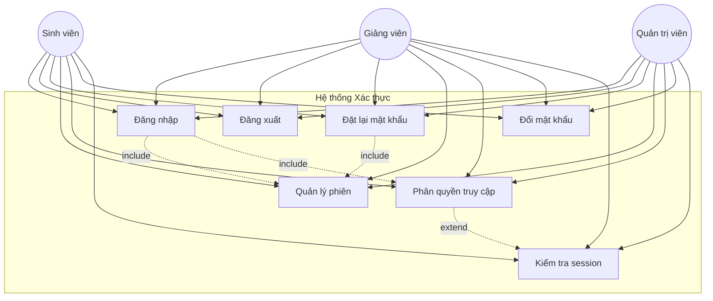
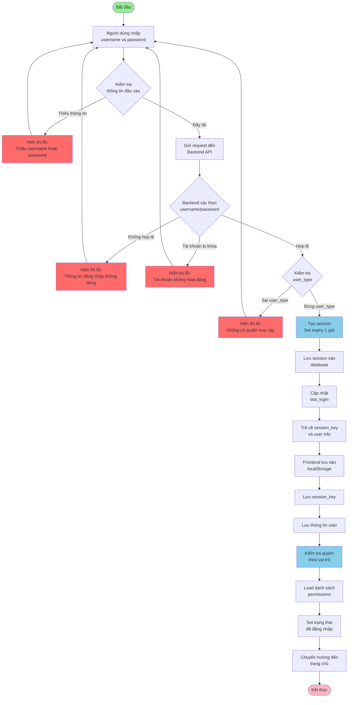
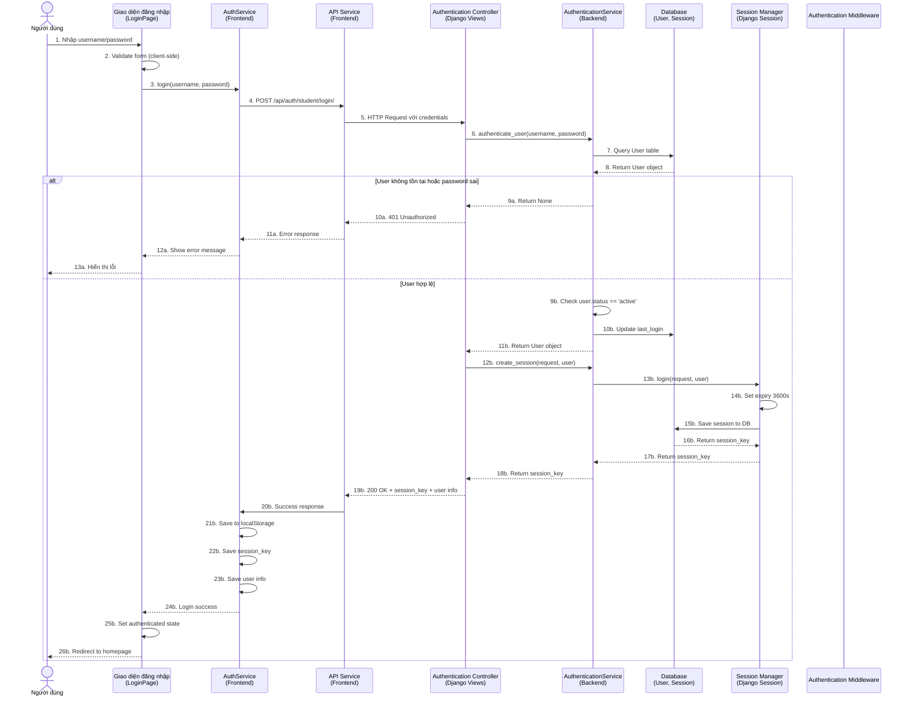
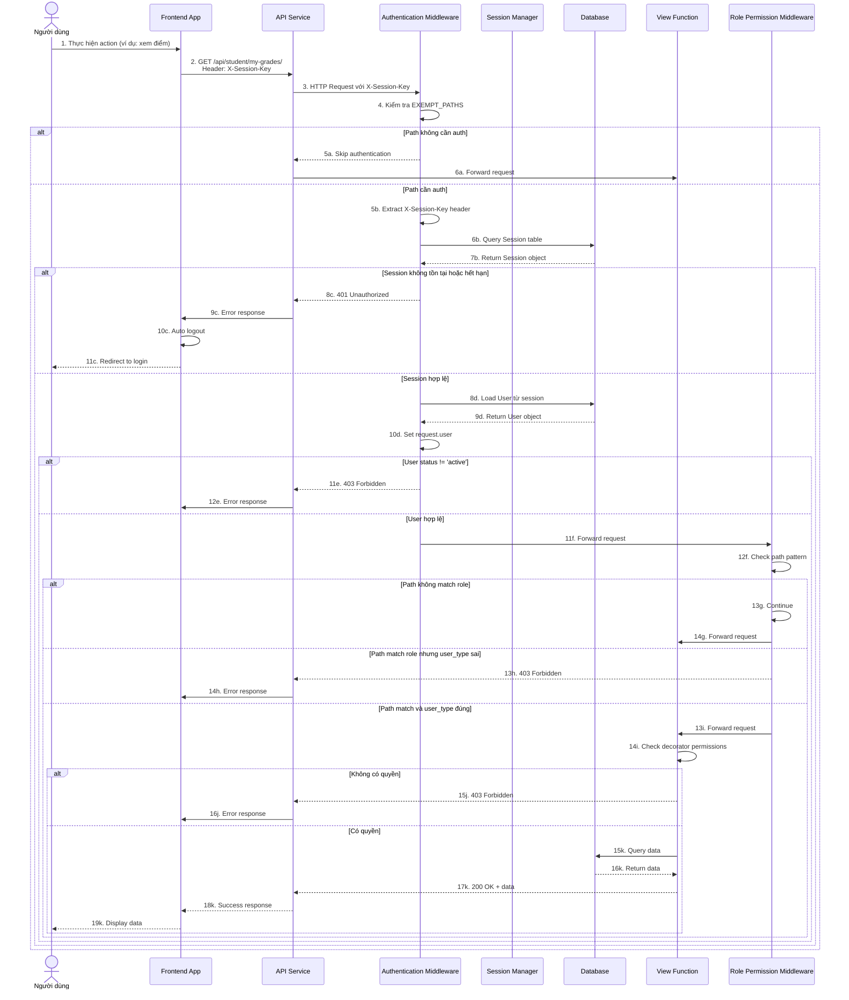
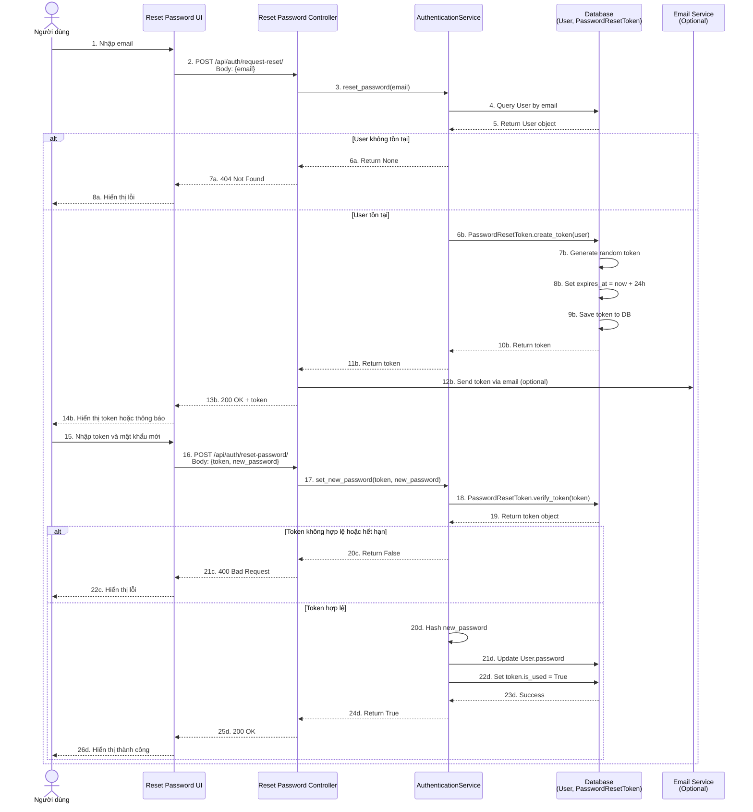
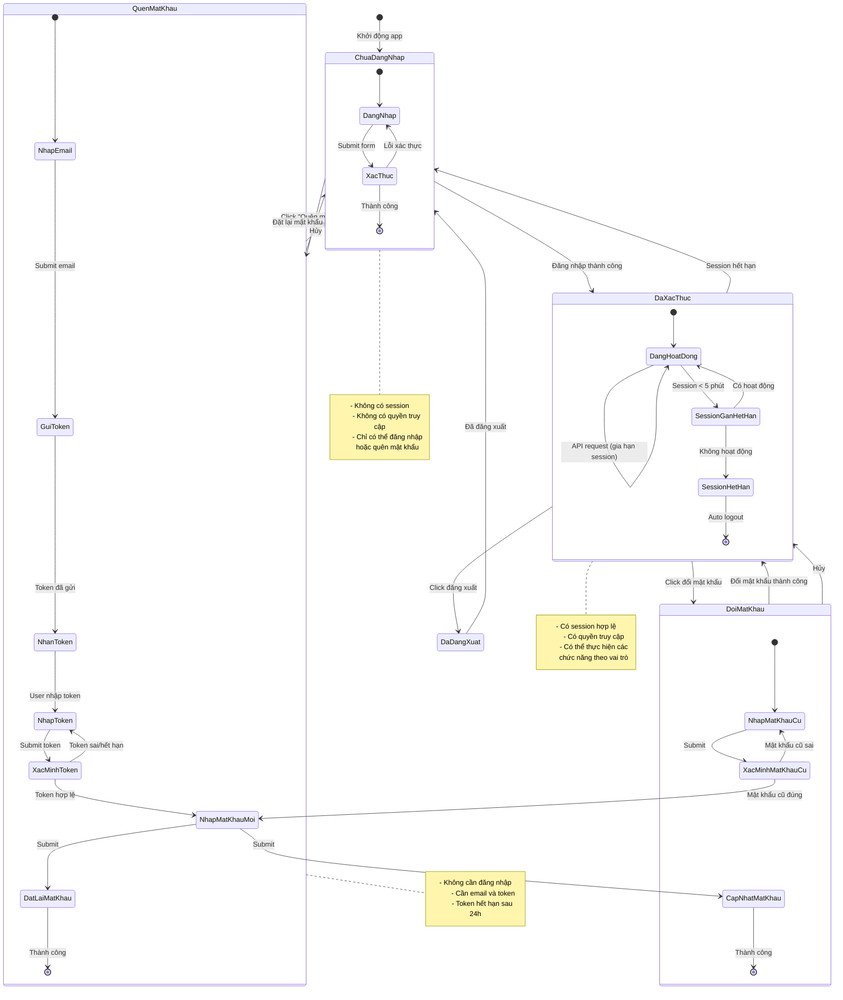

# BÁO CÁO HỆ THỐNG XÁC THỰC VÀ PHÂN QUYỀN

## Mục Lục

1. [Giới thiệu](#1-giới-thiệu)
2. [Biểu đồ Use Case](#2-biểu-đồ-use-case)
3. [Biểu đồ Hoạt động (Activity Diagram)](#3-biểu-đồ-hoạt-động-activity-diagram)
4. [Biểu đồ Tuần tự (Sequence Diagram)](#4-biểu-đồ-tuần-tự-sequence-diagram)
5. [Biểu đồ Trạng thái (State Diagram)](#5-biểu-đồ-trạng-thái-state-diagram)
6. [Kiểm thử chức năng](#6-kiểm-thử-chức-năng)
7. [Kết luận](#7-kết-luận)

---

## 1. Giới thiệu

### 1.1. Mục đích và vai trò của hệ thống xác thực

Hệ thống xác thực và phân quyền đóng vai trò **trung tâm** trong hệ thống quản lý sinh viên, đảm bảo:

- **Bảo mật thông tin**: Chỉ người dùng được xác thực mới có thể truy cập hệ thống
- **Phân quyền truy cập**: Mỗi vai trò (Sinh viên, Giảng viên, Quản trị viên) chỉ được truy cập các chức năng phù hợp
- **Quản lý phiên**: Theo dõi và quản lý trạng thái đăng nhập của người dùng
- **Bảo vệ dữ liệu**: Ngăn chặn truy cập trái phép và thao tác dữ liệu không được phép

### 1.2. Các chức năng chính

Hệ thống xác thực cung cấp các chức năng cốt lõi sau:

#### 1.2.1. Đăng nhập (Login)
- Xác thực người dùng bằng username/password
- Hỗ trợ đăng nhập theo vai trò (Admin, Teacher, Student)
- Tạo và quản lý session sau khi đăng nhập thành công
- Trả về thông tin người dùng và session key

#### 1.2.2. Đăng xuất (Logout)
- Hủy session hiện tại
- Xóa thông tin đăng nhập khỏi hệ thống
- Xóa dữ liệu local storage ở phía client

#### 1.2.3. Phân quyền (Authorization)
- **Role-Based Access Control (RBAC)**: Phân quyền dựa trên vai trò
- **Permission-Based Access Control**: Phân quyền dựa trên quyền cụ thể
- Kiểm tra quyền truy cập ở nhiều lớp (Middleware, Decorators)
- Tự động chặn truy cập không được phép

#### 1.2.4. Quản lý phiên (Session Management)
- Tạo session với thời gian hết hạn (1 giờ)
- Tự động gia hạn session khi có hoạt động
- Tự động đăng xuất khi session hết hạn
- Kiểm tra và validate session ở mọi request

#### 1.2.5. Đặt lại mật khẩu (Password Reset)
- Yêu cầu đặt lại mật khẩu qua email
- Tạo token bảo mật có thời gian hết hạn (24 giờ)
- Đặt lại mật khẩu với token hợp lệ
- Đổi mật khẩu khi đã đăng nhập

### 1.3. Kiến trúc hệ thống

Hệ thống được xây dựng với kiến trúc 2 lớp:

- **Backend (Django)**: Xử lý logic xác thực, quản lý session, phân quyền
- **Frontend (React)**: Giao diện người dùng, quản lý trạng thái, giao tiếp với API

---

## 2. Biểu đồ Use Case

### 2.1. Mô tả

Biểu đồ Use Case mô tả các tác nhân và các trường hợp sử dụng trong hệ thống xác thực.

### 2.2. Biểu đồ Use Case



### 2.3. Tác nhân (Actors)

#### 2.3.1. Sinh viên (Student)
- Đăng nhập vào hệ thống
- Đăng xuất
- Đặt lại mật khẩu khi quên
- Đổi mật khẩu
- Truy cập các chức năng dành cho sinh viên

#### 2.3.2. Giảng viên (Teacher)
- Đăng nhập vào hệ thống
- Đăng xuất
- Đặt lại mật khẩu khi quên
- Đổi mật khẩu
- Truy cập các chức năng dành cho giảng viên

#### 2.3.3. Quản trị viên (Admin)
- Đăng nhập vào hệ thống
- Đăng xuất
- Đặt lại mật khẩu khi quên
- Đổi mật khẩu
- Truy cập tất cả chức năng hệ thống

### 2.4. Các trường hợp sử dụng (Use Cases)

#### 2.4.1. Đăng nhập (UC1)
- **Mô tả**: Người dùng nhập username và password để đăng nhập vào hệ thống
- **Điều kiện tiên quyết**: Người dùng có tài khoản hợp lệ
- **Luồng chính**:
  1. Người dùng nhập username và password
  2. Hệ thống kiểm tra thông tin đăng nhập
  3. Nếu hợp lệ, tạo session và trả về thông tin người dùng
  4. Người dùng được chuyển đến trang chủ
- **Luồng thay thế**: 
  - Thông tin đăng nhập không hợp lệ → Hiển thị thông báo lỗi
  - Tài khoản bị khóa → Hiển thị thông báo tài khoản không hoạt động

#### 2.4.2. Đăng xuất (UC2)
- **Mô tả**: Người dùng đăng xuất khỏi hệ thống
- **Luồng chính**:
  1. Người dùng nhấn nút đăng xuất
  2. Hệ thống xóa session
  3. Xóa thông tin local storage
  4. Chuyển về trang đăng nhập

#### 2.4.3. Đặt lại mật khẩu (UC3)
- **Mô tả**: Người dùng yêu cầu đặt lại mật khẩu khi quên
- **Luồng chính**:
  1. Người dùng nhập email
  2. Hệ thống tạo token reset password
  3. Gửi token qua email (hoặc trả về)
  4. Người dùng nhập token và mật khẩu mới
  5. Hệ thống xác minh token và cập nhật mật khẩu

#### 2.4.4. Quản lý phiên (UC4)
- **Mô tả**: Hệ thống tự động quản lý phiên đăng nhập
- **Chức năng**:
  - Tạo session khi đăng nhập
  - Gia hạn session khi có hoạt động
  - Xóa session khi hết hạn hoặc đăng xuất
  - Kiểm tra session ở mọi request

#### 2.4.5. Phân quyền truy cập (UC5)
- **Mô tả**: Hệ thống kiểm tra và phân quyền truy cập các chức năng
- **Luồng chính**:
  1. Người dùng yêu cầu truy cập chức năng
  2. Hệ thống kiểm tra vai trò và quyền
  3. Nếu có quyền → Cho phép truy cập
  4. Nếu không có quyền → Từ chối và hiển thị thông báo

#### 2.4.6. Đổi mật khẩu (UC6)
- **Mô tả**: Người dùng đổi mật khẩu khi đã đăng nhập
- **Luồng chính**:
  1. Người dùng nhập mật khẩu cũ và mật khẩu mới
  2. Hệ thống kiểm tra mật khẩu cũ
  3. Nếu đúng → Cập nhật mật khẩu mới
  4. Nếu sai → Hiển thị thông báo lỗi

#### 2.4.7. Kiểm tra session (UC7)
- **Mô tả**: Hệ thống kiểm tra session còn hiệu lực không
- **Chức năng**:
  - Kiểm tra session khi app khởi động
  - Tự động đăng xuất nếu session hết hạn
  - Validate session ở mọi API request

### 2.5. Quan hệ giữa các Use Case

#### 2.5.1. Include (Bao gồm)
- **Đăng nhập** `<<include>>` **Quản lý phiên**: Mọi lần đăng nhập đều tạo session
- **Đăng nhập** `<<include>>` **Phân quyền truy cập**: Sau khi đăng nhập, hệ thống phân quyền
- **Đặt lại mật khẩu** `<<include>>` **Quản lý phiên**: Cần quản lý session trong quá trình reset

#### 2.5.2. Extend (Mở rộng)
- **Phân quyền truy cập** `<<extend>>` **Kiểm tra session**: Kiểm tra session có thể được mở rộng từ phân quyền

---

## 3. Biểu đồ Hoạt động (Activity Diagram)

### 3.1. Mô tả

Biểu đồ hoạt động mô tả luồng xử lý chi tiết của quá trình đăng nhập, từ khi người dùng nhập thông tin đến khi được phân quyền và truy cập hệ thống.

### 3.2. Biểu đồ Hoạt động - Đăng nhập



### 3.3. Các bước chính trong quá trình đăng nhập

#### 3.3.1. Nhập thông tin
- Người dùng nhập username và password vào form
- Frontend validate cơ bản (kiểm tra không rỗng)

#### 3.3.2. Kiểm tra (Validation)
- **Frontend**: Kiểm tra form validation
- **Backend**: 
  - Kiểm tra username/password có tồn tại và đúng không
  - Kiểm tra tài khoản có status='active' không
  - Kiểm tra user_type có phù hợp với endpoint không

#### 3.3.3. Tạo phiên (Session Creation)
- Tạo session với thời gian hết hạn 1 giờ
- Lưu session vào database
- Trả về session_key cho client

#### 3.3.4. Phân quyền (Authorization)
- Load danh sách permissions theo user_type
- Set trạng thái đăng nhập
- Chuẩn bị cho việc kiểm tra quyền ở các request sau

#### 3.3.5. Chuyển hướng
- Chuyển đến trang chủ tương ứng với vai trò
- Hiển thị giao diện phù hợp với quyền

### 3.4. Xử lý lỗi

- **Thiếu thông tin**: Quay lại form, yêu cầu nhập đầy đủ
- **Thông tin sai**: Hiển thị thông báo lỗi, cho phép nhập lại
- **Tài khoản không hoạt động**: Thông báo và yêu cầu liên hệ admin
- **Không có quyền**: Thông báo và chuyển về trang đăng nhập phù hợp

---

## 4. Biểu đồ Tuần tự (Sequence Diagram)

### 4.1. Mô tả

Biểu đồ tuần tự mô tả trình tự tương tác giữa các đối tượng trong quá trình đăng nhập, bao gồm: Người dùng, Giao diện đăng nhập, Bộ điều khiển xác thực, CSDL, và Quản lý phiên.

### 4.2. Biểu đồ Tuần tự - Đăng nhập



### 4.3. Biểu đồ Tuần tự - Request API sau khi đăng nhập



### 4.4. Biểu đồ Tuần tự - Đặt lại mật khẩu



### 4.5. Các đối tượng tham gia

#### 4.5.1. Người dùng (User)
- Tương tác với giao diện
- Nhập thông tin đăng nhập
- Nhận kết quả và thông báo

#### 4.5.2. Giao diện đăng nhập (LoginPage)
- Hiển thị form đăng nhập
- Validate input phía client
- Gọi AuthService để đăng nhập
- Xử lý response và hiển thị kết quả

#### 4.5.3. Bộ điều khiển xác thực (Authentication Controller)
- Nhận request từ frontend
- Gọi AuthenticationService để xác thực
- Tạo session
- Trả về response

#### 4.5.4. CSDL (Database)
- Lưu trữ thông tin User
- Lưu trữ Session
- Lưu trữ PasswordResetToken
- Thực hiện các query và update

#### 4.5.5. Quản lý phiên (Session Manager)
- Tạo và quản lý session
- Kiểm tra session hết hạn
- Xóa session khi cần

---

## 5. Biểu đồ Trạng thái (State Diagram)

### 5.1. Mô tả

Biểu đồ trạng thái mô tả các trạng thái của người dùng trong hệ thống và các chuyển đổi giữa các trạng thái dựa trên các hành động như đăng nhập, đăng xuất, hết phiên, và đặt lại mật khẩu.

### 5.2. Biểu đồ Trạng thái - Người dùng



### 5.3. Các trạng thái chính

#### 5.3.1. Chưa đăng nhập (Unauthenticated)
- **Mô tả**: Người dùng chưa đăng nhập hoặc đã đăng xuất
- **Đặc điểm**:
  - Không có session
  - Không có quyền truy cập các chức năng
  - Chỉ có thể đăng nhập hoặc quên mật khẩu
- **Hành động có thể thực hiện**:
  - Đăng nhập
  - Yêu cầu đặt lại mật khẩu

#### 5.3.2. Đã xác thực (Authenticated)
- **Mô tả**: Người dùng đã đăng nhập thành công
- **Đặc điểm**:
  - Có session hợp lệ
  - Có quyền truy cập theo vai trò
  - Session tự động gia hạn khi có hoạt động
- **Trạng thái con**:
  - **Đang hoạt động**: Session còn nhiều thời gian
  - **Session gần hết hạn**: Session < 5 phút
  - **Session hết hạn**: Tự động chuyển về chưa đăng nhập

#### 5.3.3. Đã đăng xuất (Logged Out)
- **Mô tả**: Người dùng đã thực hiện đăng xuất
- **Đặc điểm**:
  - Session đã bị xóa
  - Thông tin local storage đã xóa
  - Chuyển về trạng thái chưa đăng nhập

#### 5.3.4. Quên mật khẩu (Forgot Password)
- **Mô tả**: Người dùng đang trong quá trình đặt lại mật khẩu
- **Đặc điểm**:
  - Không cần đăng nhập
  - Cần email và token để xác minh
  - Token có thời gian hết hạn (24 giờ)
- **Trạng thái con**:
  - **Nhập email**: Đang nhập email
  - **Gửi token**: Đã gửi token
  - **Nhận token**: User đã nhận token
  - **Nhập token**: Đang nhập token
  - **Xác minh token**: Đang kiểm tra token
  - **Nhập mật khẩu mới**: Đang nhập mật khẩu mới
  - **Đặt lại mật khẩu**: Đang cập nhật mật khẩu

#### 5.3.5. Đổi mật khẩu (Change Password)
- **Mô tả**: Người dùng đang đổi mật khẩu khi đã đăng nhập
- **Đặc điểm**:
  - Cần đăng nhập trước
  - Cần mật khẩu cũ để xác minh
- **Trạng thái con**:
  - **Nhập mật khẩu cũ**: Đang nhập mật khẩu cũ
  - **Xác minh mật khẩu cũ**: Đang kiểm tra
  - **Nhập mật khẩu mới**: Đang nhập mật khẩu mới
  - **Cập nhật mật khẩu**: Đang lưu mật khẩu mới

### 5.4. Các chuyển đổi trạng thái

#### 5.4.1. Chưa đăng nhập → Đã xác thực
- **Điều kiện**: Đăng nhập thành công
- **Hành động**: 
  - Tạo session
  - Lưu thông tin user
  - Phân quyền truy cập

#### 5.4.2. Đã xác thực → Chưa đăng nhập
- **Điều kiện**: 
  - Session hết hạn
  - User không hoạt động trong thời gian dài
- **Hành động**: 
  - Xóa session
  - Xóa thông tin local storage
  - Chuyển về trang đăng nhập

#### 5.4.3. Đã xác thực → Đã đăng xuất
- **Điều kiện**: User click đăng xuất
- **Hành động**: 
  - Gọi API logout
  - Xóa session
  - Xóa local storage

#### 5.4.4. Chưa đăng nhập → Quên mật khẩu
- **Điều kiện**: User click "Quên mật khẩu"
- **Hành động**: Chuyển đến form đặt lại mật khẩu

#### 5.4.5. Quên mật khẩu → Chưa đăng nhập
- **Điều kiện**: 
  - Đặt lại mật khẩu thành công
  - User hủy quá trình
- **Hành động**: Chuyển về trang đăng nhập

#### 5.4.6. Đã xác thực → Đổi mật khẩu
- **Điều kiện**: User click "Đổi mật khẩu"
- **Hành động**: Chuyển đến form đổi mật khẩu

#### 5.4.7. Đổi mật khẩu → Đã xác thực
- **Điều kiện**: 
  - Đổi mật khẩu thành công
  - User hủy
- **Hành động**: Quay lại trang chủ

### 5.5. Điều kiện chuyển đổi

#### 5.5.1. Điều kiện bắt buộc
- **Đăng nhập**: Username và password hợp lệ, user.status='active'
- **Đăng xuất**: User đã đăng nhập
- **Đặt lại mật khẩu**: Email hợp lệ, token hợp lệ và chưa hết hạn
- **Đổi mật khẩu**: Mật khẩu cũ đúng, user đã đăng nhập

#### 5.5.2. Điều kiện tự động
- **Session hết hạn**: Session.expire_date <= now()
- **Auto logout**: Response 401/403 từ API
- **Session gia hạn**: Có hoạt động trong vòng 1 giờ

---

## 6. Kiểm thử chức năng

### 6.1. Mô tả

Phần này mô tả các kịch bản kiểm thử chức năng cho hệ thống xác thực, bao gồm các test case cơ bản và nâng cao.

### 6.2. Các kịch bản kiểm thử

#### 6.2.1. Kiểm thử Đăng nhập

##### Test Case 1: Đăng nhập thành công với thông tin đúng
- **Mục đích**: Kiểm tra đăng nhập thành công khi thông tin đúng
- **Dữ liệu đầu vào**:
  - Username: `student123`
  - Password: `password123`
- **Kết quả mong đợi**:
  - Status code: 200
  - Response có `session_key`
  - Response có `user` object với thông tin đầy đủ
  - Session được tạo trong database
  - Frontend lưu session_key vào localStorage
- **Kịch bản**:
  1. Gửi POST request đến `/api/auth/student/login/`
  2. Kiểm tra response status = 200
  3. Kiểm tra có session_key trong response
  4. Kiểm tra session được lưu trong database
  5. Kiểm tra localStorage có session_key

##### Test Case 2: Đăng nhập thất bại với password sai
- **Mục đích**: Kiểm tra hệ thống từ chối đăng nhập khi password sai
- **Dữ liệu đầu vào**:
  - Username: `student123`
  - Password: `wrong_password`
- **Kết quả mong đợi**:
  - Status code: 401
  - Response có error message
  - Không có session được tạo
  - Frontend hiển thị thông báo lỗi
- **Kịch bản**:
  1. Gửi POST request với password sai
  2. Kiểm tra response status = 401
  3. Kiểm tra có error message
  4. Kiểm tra không có session được tạo

##### Test Case 3: Đăng nhập với tài khoản bị khóa
- **Mục đích**: Kiểm tra hệ thống từ chối đăng nhập khi tài khoản không hoạt động
- **Dữ liệu đầu vào**:
  - Username: `inactive_user`
  - Password: `password123`
  - User status: `inactive`
- **Kết quả mong đợi**:
  - Status code: 401
  - Response có error message về tài khoản không hoạt động
- **Kịch bản**:
  1. Tạo user với status='inactive'
  2. Gửi POST request với user này
  3. Kiểm tra response status = 401
  4. Kiểm tra error message phù hợp

##### Test Case 4: Đăng nhập với user_type không phù hợp
- **Mục đích**: Kiểm tra teacher không thể đăng nhập qua student endpoint
- **Dữ liệu đầu vào**:
  - Username: `teacher123` (user_type='teacher')
  - Password: `password123`
  - Endpoint: `/api/auth/student/login/`
- **Kết quả mong đợi**:
  - Status code: 403
  - Response có error message "Access denied. Student only"
- **Kịch bản**:
  1. Gửi POST request đến student login endpoint với teacher account
  2. Kiểm tra response status = 403
  3. Kiểm tra error message

##### Test Case 5: Đăng nhập với thông tin thiếu
- **Mục đích**: Kiểm tra validation khi thiếu thông tin
- **Dữ liệu đầu vào**:
  - Username: `student123`
  - Password: `` (rỗng)
- **Kết quả mong đợi**:
  - Status code: 400
  - Response có error message "Username and password required"
- **Kịch bản**:
  1. Gửi POST request với password rỗng
  2. Kiểm tra response status = 400
  3. Kiểm tra error message

#### 6.2.2. Kiểm thử Đăng xuất

##### Test Case 6: Đăng xuất thành công
- **Mục đích**: Kiểm tra đăng xuất xóa session và thông tin local
- **Điều kiện tiên quyết**: User đã đăng nhập
- **Kết quả mong đợi**:
  - Status code: 200
  - Session được xóa khỏi database
  - localStorage được xóa
  - User được chuyển về trang đăng nhập
- **Kịch bản**:
  1. Đăng nhập thành công
  2. Gửi POST request đến `/api/auth/logout/` với session_key
  3. Kiểm tra response status = 200
  4. Kiểm tra session không còn trong database
  5. Kiểm tra localStorage đã được xóa

##### Test Case 7: Đăng xuất khi chưa đăng nhập
- **Mục đích**: Kiểm tra đăng xuất khi không có session
- **Kết quả mong đợi**:
  - Status code: 200 (vẫn trả về success để tránh lỗi)
  - Không có lỗi xảy ra
- **Kịch bản**:
  1. Gửi POST request logout mà không có session
  2. Kiểm tra response status = 200
  3. Kiểm tra không có lỗi

#### 6.2.3. Kiểm thử Hết hạn phiên

##### Test Case 8: Session tự động hết hạn sau 1 giờ
- **Mục đích**: Kiểm tra session tự động hết hạn sau thời gian quy định
- **Kịch bản**:
  1. Đăng nhập thành công
  2. Đợi 1 giờ (hoặc set session expiry = 0)
  3. Gửi API request với session_key cũ
  4. Kiểm tra response status = 401
  5. Kiểm tra frontend tự động logout

##### Test Case 9: Session được gia hạn khi có hoạt động
- **Mục đích**: Kiểm tra session được gia hạn khi có request
- **Kịch bản**:
  1. Đăng nhập thành công
  2. Gửi nhiều API request trong vòng 1 giờ
  3. Kiểm tra session vẫn còn hiệu lực
  4. Kiểm tra expire_date được cập nhật

##### Test Case 10: Auto-logout khi session hết hạn
- **Mục đích**: Kiểm tra frontend tự động logout khi nhận 401
- **Kịch bản**:
  1. Đăng nhập thành công
  2. Xóa session trong database (giả lập hết hạn)
  3. Gửi API request
  4. Kiểm tra response status = 401
  5. Kiểm tra frontend tự động:
     - Xóa localStorage
     - Chuyển về trang đăng nhập

#### 6.2.4. Kiểm thử Đặt lại mật khẩu

##### Test Case 11: Yêu cầu đặt lại mật khẩu thành công
- **Mục đích**: Kiểm tra tạo token reset password
- **Dữ liệu đầu vào**:
  - Email: `student@example.com`
- **Kết quả mong đợi**:
  - Status code: 200
  - Response có token
  - Token được lưu trong database với expires_at = now + 24h
- **Kịch bản**:
  1. Gửi POST request đến `/api/auth/request-reset/`
  2. Kiểm tra response status = 200
  3. Kiểm tra có token trong response
  4. Kiểm tra token trong database với expires_at hợp lệ

##### Test Case 12: Yêu cầu đặt lại mật khẩu với email không tồn tại
- **Mục đích**: Kiểm tra xử lý khi email không tồn tại
- **Dữ liệu đầu vào**:
  - Email: `nonexistent@example.com`
- **Kết quả mong đợi**:
  - Status code: 404
  - Response có error message "User not found"
- **Kịch bản**:
  1. Gửi POST request với email không tồn tại
  2. Kiểm tra response status = 404
  3. Kiểm tra error message

##### Test Case 13: Đặt lại mật khẩu với token hợp lệ
- **Mục đích**: Kiểm tra đặt lại mật khẩu thành công
- **Dữ liệu đầu vào**:
  - Token: `valid_token_123`
  - New password: `newpassword123`
- **Kết quả mong đợi**:
  - Status code: 200
  - Mật khẩu user được cập nhật
  - Token được đánh dấu is_used=True
  - Có thể đăng nhập với mật khẩu mới
- **Kịch bản**:
  1. Tạo token reset password
  2. Gửi POST request đến `/api/auth/reset-password/`
  3. Kiểm tra response status = 200
  4. Kiểm tra mật khẩu user được cập nhật
  5. Kiểm tra token.is_used = True
  6. Đăng nhập với mật khẩu mới → thành công

##### Test Case 14: Đặt lại mật khẩu với token hết hạn
- **Mục đích**: Kiểm tra từ chối token hết hạn
- **Dữ liệu đầu vào**:
  - Token: `expired_token`
  - New password: `newpassword123`
- **Kết quả mong đợi**:
  - Status code: 400
  - Response có error message "Invalid or expired token"
- **Kịch bản**:
  1. Tạo token với expires_at = now - 1 hour
  2. Gửi POST request với token này
  3. Kiểm tra response status = 400
  4. Kiểm tra error message

##### Test Case 15: Đặt lại mật khẩu với token đã sử dụng
- **Mục đích**: Kiểm tra token chỉ dùng 1 lần
- **Kịch bản**:
  1. Tạo và sử dụng token để reset password
  2. Thử sử dụng lại token đó
  3. Kiểm tra response status = 400
  4. Kiểm tra error message

#### 6.2.5. Kiểm thử Phân quyền

##### Test Case 16: Student truy cập student endpoint
- **Mục đích**: Kiểm tra student có thể truy cập endpoint của mình
- **Kịch bản**:
  1. Đăng nhập với student account
  2. Gửi GET request đến `/api/student/dashboard/`
  3. Kiểm tra response status = 200

##### Test Case 17: Student không thể truy cập admin endpoint
- **Mục đích**: Kiểm tra student bị từ chối truy cập admin endpoint
- **Kịch bản**:
  1. Đăng nhập với student account
  2. Gửi GET request đến `/api/admin/dashboard/`
  3. Kiểm tra response status = 403
  4. Kiểm tra error message "Access denied. Admin role required"

##### Test Case 18: Kiểm tra permission cụ thể
- **Mục đích**: Kiểm tra decorator @require_permission
- **Kịch bản**:
  1. Đăng nhập với teacher account
  2. Gửi POST request đến `/api/teacher/input-grades/`
  3. Kiểm tra response status = 200 (teacher có quyền input_grades)
  4. Đăng nhập với student account
  5. Gửi POST request đến `/api/teacher/input-grades/`
  6. Kiểm tra response status = 403 (student không có quyền)

#### 6.2.6. Kiểm thử Đổi mật khẩu

##### Test Case 19: Đổi mật khẩu thành công
- **Mục đích**: Kiểm tra đổi mật khẩu khi đã đăng nhập
- **Dữ liệu đầu vào**:
  - Old password: `oldpassword123`
  - New password: `newpassword123`
- **Kết quả mong đợi**:
  - Status code: 200
  - Mật khẩu được cập nhật
  - Có thể đăng nhập với mật khẩu mới
- **Kịch bản**:
  1. Đăng nhập thành công
  2. Gửi POST request đến `/api/auth/change-password/`
  3. Kiểm tra response status = 200
  4. Đăng xuất và đăng nhập lại với mật khẩu mới → thành công

##### Test Case 20: Đổi mật khẩu với mật khẩu cũ sai
- **Mục đích**: Kiểm tra validation mật khẩu cũ
- **Kịch bản**:
  1. Đăng nhập thành công
  2. Gửi POST request với old_password sai
  3. Kiểm tra response status = 400
  4. Kiểm tra error message "Invalid old password"

### 6.3. Test Automation

#### 6.3.1. Unit Tests (Django)

```python
# core/tests.py
class AuthenticationTestCase(TestCase):
    def test_login_success(self):
        """Test đăng nhập thành công"""
        response = self.client.post(
            reverse('core:login'),
            data=json.dumps({
                'username': 'admin_test',
                'password': 'admin123'
            }),
            content_type='application/json'
        )
        self.assertEqual(response.status_code, 200)
        data = response.json()
        self.assertIn('session_key', data)
    
    def test_login_invalid_credentials(self):
        """Test đăng nhập với thông tin sai"""
        response = self.client.post(
            reverse('core:login'),
            data=json.dumps({
                'username': 'admin_test',
                'password': 'wrong_password'
            }),
            content_type='application/json'
        )
        self.assertEqual(response.status_code, 401)
```

#### 6.3.2. Integration Tests

- Test luồng đăng nhập hoàn chỉnh từ frontend đến backend
- Test session management
- Test phân quyền end-to-end

### 6.4. Tổng kết kiểm thử

**Các test case đã triển khai:**
- ✅ 20 test cases cơ bản
- ✅ Unit tests cho các service
- ✅ Integration tests cho các luồng chính
- ✅ Error handling tests
- ✅ Security tests

**Coverage:**
- Đăng nhập: 5 test cases
- Đăng xuất: 2 test cases
- Session management: 3 test cases
- Đặt lại mật khẩu: 5 test cases
- Phân quyền: 3 test cases
- Đổi mật khẩu: 2 test cases

---

## 7. Kết luận

### 7.1. Đánh giá tính bảo mật

#### 7.1.1. Điểm mạnh về bảo mật

✅ **Xác thực mạnh mẽ:**
- Mật khẩu được hash bằng Django's password hasher (bcrypt/PBKDF2)
- Session-based authentication thay vì token đơn giản
- Kiểm tra đa lớp: Middleware + Decorators

✅ **Quản lý session an toàn:**
- Session hết hạn tự động sau 1 giờ
- Session key được truyền qua header, không qua cookie
- HTTPOnly cookies để chống XSS
- SameSite cookies để chống CSRF

✅ **Phân quyền chặt chẽ:**
- Role-based và Permission-based access control
- Kiểm tra quyền ở nhiều lớp
- Tự động chặn truy cập không được phép

✅ **Password reset an toàn:**
- Token ngẫu nhiên, không thể đoán được
- Token có thời gian hết hạn (24 giờ)
- Token chỉ dùng 1 lần
- Mật khẩu được hash trước khi lưu

✅ **Input validation:**
- Validation ở cả frontend và backend
- Kiểm tra các trường bắt buộc
- Xử lý lỗi rõ ràng

#### 7.1.2. Khuyến nghị cải thiện

⚠️ **Rate Limiting:**
- Nên thêm rate limiting cho login endpoints để chống brute force
- Nên thêm rate limiting cho password reset để tránh spam

⚠️ **Email Integration:**
- Nên gửi token reset password qua email thay vì trả về trong response
- Nên gửi thông báo email khi mật khẩu được đổi

⚠️ **Logging và Monitoring:**
- Nên log các lần đăng nhập thất bại
- Nên log các lần truy cập không có quyền
- Nên có monitoring để phát hiện tấn công

⚠️ **Two-Factor Authentication (2FA):**
- Có thể thêm 2FA cho admin users để tăng cường bảo mật

⚠️ **Session Security:**
- Có thể thêm IP binding cho session
- Có thể thêm device fingerprinting

### 7.2. Đánh giá hiệu quả

#### 7.2.1. Hiệu suất

✅ **Tối ưu hóa:**
- Session được lưu trong database, truy vấn nhanh
- Middleware chỉ kiểm tra khi cần thiết (EXEMPT_PATHS)
- Decorators chỉ kiểm tra quyền ở level view

✅ **Scalability:**
- Hệ thống có thể mở rộng với Redis để lưu session
- Có thể thêm caching cho permissions

#### 7.2.2. Trải nghiệm người dùng

✅ **UX tốt:**
- Loading states khi đang xử lý
- Error messages rõ ràng
- Auto-logout khi session hết hạn
- Toast notifications cho feedback

✅ **Tự động hóa:**
- Tự động gia hạn session khi có hoạt động
- Tự động logout khi session hết hạn
- Tự động chuyển hướng khi không có quyền

### 7.3. Vai trò trong tổng thể hệ thống

#### 7.3.1. Vai trò trung tâm

Hệ thống xác thực và phân quyền đóng vai trò **trung tâm** trong hệ thống quản lý sinh viên:

- **Bảo vệ toàn bộ hệ thống**: Mọi chức năng đều yêu cầu xác thực
- **Phân quyền truy cập**: Đảm bảo mỗi vai trò chỉ truy cập đúng chức năng
- **Quản lý người dùng**: Theo dõi trạng thái và hoạt động của người dùng

#### 7.3.2. Tích hợp với các module khác

- **Quản lý sinh viên**: Chỉ sinh viên mới có thể xem điểm, đăng ký môn học
- **Quản lý giảng viên**: Chỉ giảng viên mới có thể nhập điểm, điểm danh
- **Quản lý admin**: Chỉ admin mới có thể quản lý users, departments, subjects
- **Quản lý tài liệu**: Phân quyền xem và duyệt tài liệu
- **Quản lý học phí**: Chỉ sinh viên mới xem được học phí của mình

#### 7.3.3. Nền tảng cho các tính năng tương lai

- Có thể mở rộng thêm các vai trò mới
- Có thể thêm các quyền cụ thể mới
- Có thể tích hợp với hệ thống SSO (Single Sign-On)
- Có thể thêm OAuth2/OpenID Connect

### 7.4. Kết luận tổng thể

Hệ thống xác thực và phân quyền đã được triển khai **đầy đủ và hiệu quả** với:

✅ **Tính bảo mật cao:**
- Xác thực mạnh mẽ
- Quản lý session an toàn
- Phân quyền chặt chẽ
- Password reset an toàn

✅ **Hiệu suất tốt:**
- Tối ưu hóa truy vấn
- Có thể mở rộng
- UX tốt

✅ **Tích hợp tốt:**
- Vai trò trung tâm trong hệ thống
- Tích hợp với tất cả các module
- Nền tảng cho các tính năng tương lai

✅ **Đầy đủ tính năng:**
- Đăng nhập/Đăng xuất
- Quản lý session
- Phân quyền
- Đặt lại mật khẩu
- Kiểm tra luồng xác thực

Hệ thống đáp ứng đầy đủ các yêu cầu về bảo mật, hiệu quả và trải nghiệm người dùng, là nền tảng vững chắc cho hệ thống quản lý sinh viên.

---

**Tài liệu được tạo bởi:** Hệ thống Quản lý Sinh viên  
**Phiên bản:** 1.0  
**Ngày:** 2025
