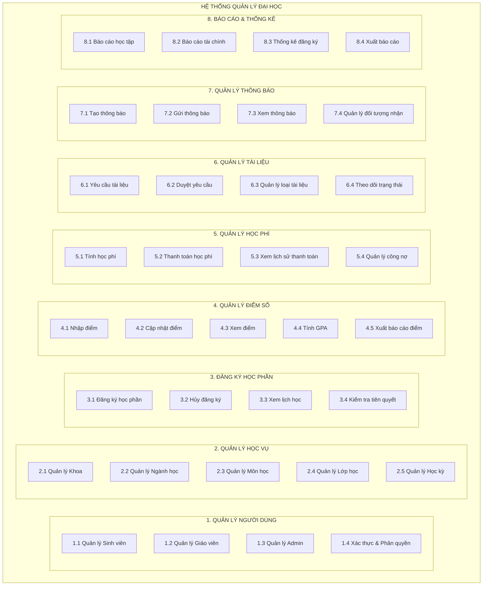

# SƠ ĐỒ CHỨC NĂNG BFD MỨC 2 - MERMAID

```mermaid
graph TD
    ROOT["HỆ THỐNG QUẢN LÝ ĐẠI HỌC"]
    
    %% Chức năng mức 1
    F1["1. Quản lý Người dùng"]
    F2["2. Quản lý Học vụ"]
    F3["3. Đăng ký Học phần"]
    F4["4. Quản lý Điểm số"]
    F5["5. Quản lý Học phí"]
    F6["6. Quản lý Tài liệu"]
    F7["7. Quản lý Thông báo"]
    F8["8. Báo cáo & Thống kê"]
    
    %% Chức năng mức 2 - Quản lý Người dùng
    F1_1["1.1 Quản lý Sinh viên"]
    F1_2["1.2 Quản lý Giáo viên"]
    F1_3["1.3 Quản lý Admin"]
    F1_4["1.4 Xác thực & Phân quyền"]
    
    %% Chức năng mức 2 - Quản lý Học vụ
    F2_1["2.1 Quản lý Khoa"]
    F2_2["2.2 Quản lý Ngành học"]
    F2_3["2.3 Quản lý Môn học"]
    F2_4["2.4 Quản lý Lớp học"]
    F2_5["2.5 Quản lý Học kỳ"]
    
    %% Chức năng mức 2 - Đăng ký Học phần
    F3_1["3.1 Đăng ký học phần"]
    F3_2["3.2 Hủy đăng ký"]
    F3_3["3.3 Xem lịch học"]
    F3_4["3.4 Kiểm tra tiên quyết"]
    
    %% Chức năng mức 2 - Quản lý Điểm số
    F4_1["4.1 Nhập điểm"]
    F4_2["4.2 Cập nhật điểm"]
    F4_3["4.3 Xem điểm"]
    F4_4["4.4 Tính GPA"]
    F4_5["4.5 Xuất báo cáo điểm"]
    
    %% Chức năng mức 2 - Quản lý Học phí
    F5_1["5.1 Tính học phí"]
    F5_2["5.2 Thanh toán học phí"]
    F5_3["5.3 Xem lịch sử thanh toán"]
    F5_4["5.4 Quản lý công nợ"]
    
    %% Chức năng mức 2 - Quản lý Tài liệu
    F6_1["6.1 Yêu cầu tài liệu"]
    F6_2["6.2 Duyệt yêu cầu"]
    F6_3["6.3 Quản lý loại tài liệu"]
    F6_4["6.4 Theo dõi trạng thái"]
    
    %% Chức năng mức 2 - Quản lý Thông báo
    F7_1["7.1 Tạo thông báo"]
    F7_2["7.2 Gửi thông báo"]
    F7_3["7.3 Xem thông báo"]
    F7_4["7.4 Quản lý đối tượng nhận"]
    
    %% Chức năng mức 2 - Báo cáo & Thống kê
    F8_1["8.1 Báo cáo học tập"]
    F8_2["8.2 Báo cáo tài chính"]
    F8_3["8.3 Thống kê đăng ký"]
    F8_4["8.4 Xuất báo cáo"]
    
    %% Kết nối từ ROOT đến mức 1
    ROOT --> F1
    ROOT --> F2
    ROOT --> F3
    ROOT --> F4
    ROOT --> F5
    ROOT --> F6
    ROOT --> F7
    ROOT --> F8
    
    %% Kết nối từ mức 1 đến mức 2
    F1 --> F1_1
    F1 --> F1_2
    F1 --> F1_3
    F1 --> F1_4
    
    F2 --> F2_1
    F2 --> F2_2
    F2 --> F2_3
    F2 --> F2_4
    F2 --> F2_5
    
    F3 --> F3_1
    F3 --> F3_2
    F3 --> F3_3
    F3 --> F3_4
    
    F4 --> F4_1
    F4 --> F4_2
    F4 --> F4_3
    F4 --> F4_4
    F4 --> F4_5
    
    F5 --> F5_1
    F5 --> F5_2
    F5 --> F5_3
    F5 --> F5_4
    
    F6 --> F6_1
    F6 --> F6_2
    F6 --> F6_3
    F6 --> F6_4
    
    F7 --> F7_1
    F7 --> F7_2
    F7 --> F7_3
    F7 --> F7_4
    
    F8 --> F8_1
    F8 --> F8_2
    F8 --> F8_3
    F8 --> F8_4
    
    %% Styling
    classDef rootClass fill:#FFE5B4,stroke:#2A4E6C,stroke-width:3px
    classDef level1Class fill:#B8E6B8,stroke:#2A4E6C,stroke-width:2px
    classDef level2Class fill:#E8F4F8,stroke:#2A4E6C,stroke-width:1px
    
    class ROOT rootClass
    class F1,F2,F3,F4,F5,F6,F7,F8 level1Class
    class F1_1,F1_2,F1_3,F1_4,F2_1,F2_2,F2_3,F2_4,F2_5,F3_1,F3_2,F3_3,F3_4,F4_1,F4_2,F4_3,F4_4,F4_5,F5_1,F5_2,F5_3,F5_4,F6_1,F6_2,F6_3,F6_4,F7_1,F7_2,F7_3,F7_4,F8_1,F8_2,F8_3,F8_4 level2Class
```

## SƠ ĐỒ DẠNG FLOWCHART

```mermaid
flowchart TB
    subgraph "HỆ THỐNG QUẢN LÝ ĐẠI HỌC"
        subgraph "1. QUẢN LÝ NGƯỜI DÙNG"
            A1[1.1 Quản lý Sinh viên]
            A2[1.2 Quản lý Giáo viên]
            A3[1.3 Quản lý Admin]
            A4[1.4 Xác thực & Phân quyền]
        end
        
        subgraph "2. QUẢN LÝ HỌC VỤ"
            B1[2.1 Quản lý Khoa]
            B2[2.2 Quản lý Ngành học]
            B3[2.3 Quản lý Môn học]
            B4[2.4 Quản lý Lớp học]
            B5[2.5 Quản lý Học kỳ]
        end
        
        subgraph "3. ĐĂNG KÝ HỌC PHẦN"
            C1[3.1 Đăng ký học phần]
            C2[3.2 Hủy đăng ký]
            C3[3.3 Xem lịch học]
            C4[3.4 Kiểm tra tiên quyết]
        end
        
        subgraph "4. QUẢN LÝ ĐIỂM SỐ"
            D1[4.1 Nhập điểm]
            D2[4.2 Cập nhật điểm]
            D3[4.3 Xem điểm]
            D4[4.4 Tính GPA]
            D5[4.5 Xuất báo cáo điểm]
        end
        
        subgraph "5. QUẢN LÝ HỌC PHÍ"
            E1[5.1 Tính học phí]
            E2[5.2 Thanh toán học phí]
            E3[5.3 Xem lịch sử thanh toán]
            E4[5.4 Quản lý công nợ]
        end
        
        subgraph "6. QUẢN LÝ TÀI LIỆU"
            F1[6.1 Yêu cầu tài liệu]
            F2[6.2 Duyệt yêu cầu]
            F3[6.3 Quản lý loại tài liệu]
            F4[6.4 Theo dõi trạng thái]
        end
        
        subgraph "7. QUẢN LÝ THÔNG BÁO"
            G1[7.1 Tạo thông báo]
            G2[7.2 Gửi thông báo]
            G3[7.3 Xem thông báo]
            G4[7.4 Quản lý đối tượng nhận]
        end
        
        subgraph "8. BÁO CÁO & THỐNG KÊ"
            H1[8.1 Báo cáo học tập]
            H2[8.2 Báo cáo tài chính]
            H3[8.3 Thống kê đăng ký]
            H4[8.4 Xuất báo cáo]
        end
    end
```
